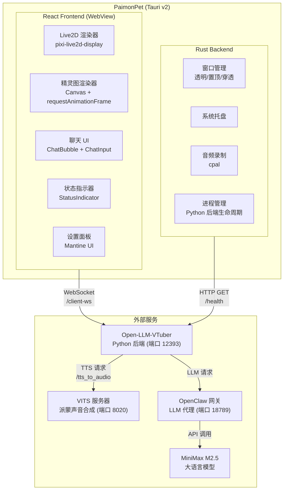
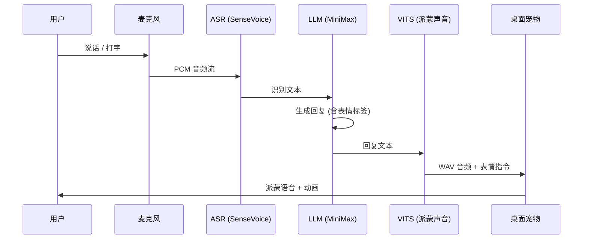

# PaimonPet 🌟

> 原神派蒙桌面宠物 — AI 语音对话 · Live2D 动画 · 桌面伴侣

PaimonPet 是一个桌面宠物应用，将原神中的派蒙带到你的桌面上。她以透明置顶窗口的形式常驻桌面，支持语音和文字对话，使用派蒙自己的声音（VITS TTS）回复，并带有 Live2D 表情动画。

## 功能特性

| 功能 | 说明 |
|------|------|
| Live2D / 精灵图双模式 | 支持完整 Live2D 模型渲染（口型同步、表情系统）和精灵图动画两种视觉模式 |
| 语音对话 | 按键说话 → 本地 ASR 识别 → LLM 对话 → VITS 派蒙语音合成 → 播放 |
| 文字聊天 | 点击宠物打开聊天输入框，打字对话 |
| 表情同步 | LLM 输出情绪标签自动映射到 Live2D 表情（开心/悲伤/愤怒/惊讶等） |
| 口型同步 | TTS 音频播放时自动同步 Live2D 嘴型参数 |
| 系统托盘 | 右键菜单：显示/隐藏/静音/设置/退出 |
| 设置面板 | 通用、宠物、语音、AI、高级、关于 六大设置分类 |
| 后端管理 | 自动检测/启动 Open-LLM-VTuber Python 后端 |

## 系统架构



## 数据流



## 项目结构

```
paimon-pet/
├── src/                          # React 前端
│   ├── components/               # UI 组件
│   │   ├── PetWindow.tsx         # 主宠物窗口
│   │   ├── ChatBubble.tsx        # 聊天气泡
│   │   ├── ChatInput.tsx         # 文字输入框
│   │   └── StatusIndicator.tsx   # 状态指示器
│   ├── renderers/                # 渲染器
│   │   ├── Live2DRenderer.tsx    # Live2D 模型渲染
│   │   └── SpriteRenderer.tsx    # 精灵图动画
│   ├── settings/                 # 设置面板
│   │   ├── SettingsPanel.tsx     # 设置主面板 (6 个标签页)
│   │   ├── GeneralSettings.tsx   # 通用设置
│   │   ├── PetSettings.tsx       # 宠物设置
│   │   ├── VoiceSettings.tsx     # 语音设置
│   │   └── AISettings.tsx        # AI/TTS 设置
│   ├── stores/                   # Zustand 状态管理
│   │   ├── petStore.ts          # 宠物视觉状态
│   │   ├── chatStore.ts         # 聊天消息
│   │   └── settingsStore.ts     # 应用设置
│   ├── hooks/                    # React Hooks
│   │   ├── useWebSocket.ts      # WebSocket 连接管理
│   │   └── useAudio.ts          # 音频播放
│   ├── services/                 # 核心服务
│   │   ├── websocketService.ts  # WebSocket 客户端 (自动重连)
│   │   └── audioService.ts      # 音频解码与播放
│   └── types/                    # TypeScript 类型定义
│       ├── messages.ts          # WebSocket 消息协议
│       ├── settings.ts          # 设置 Schema
│       └── pet.ts               # 宠物状态类型
├── src-tauri/                    # Tauri v2 Rust 后端
│   ├── src/
│   │   ├── main.rs              # 入口点
│   │   ├── lib.rs               # 模块注册与 Tauri Builder
│   │   ├── window/
│   │   │   └── tray.rs          # 系统托盘 (显示/隐藏/静音/设置/退出)
│   │   ├── audio/
│   │   │   └── capture.rs       # 麦克风音频录制
│   │   ├── backend/
│   │   │   └── process.rs       # Python 后端进程管理
│   │   ├── commands/            # Tauri 命令
│   │   └── config/
│   │       └── settings.rs      # Rust 端设置类型
│   ├── tauri.conf.json          # Tauri 窗口配置
│   └── Cargo.toml               # Rust 依赖
├── backend/                      # Open-LLM-VTuber 集成
│   ├── start.py                 # 后端启动脚本
│   └── conf.yaml                # 派蒙角色配置
├── assets/                       # 静态资源
│   └── sprites/paimon/          # 精灵图资源
├── tests/                        # 测试文件
│   └── frontend/
│       ├── stores/              # 状态管理测试
│       ├── services/            # 服务层测试
│       └── components/          # 组件测试
├── package.json
├── vite.config.ts
├── vitest.config.ts
└── tsconfig.json
```

## 快速开始

### 环境要求

| 工具 | 版本 | 用途 |
|------|------|------|
| Node.js | 18+ | 前端构建 |
| Rust | 1.80+ | Tauri 后端 |
| Python | 3.10+ | AI 后端 |
| [Open-LLM-VTuber](https://github.com/Open-LLM-VTuber/Open-LLM-VTuber) | latest | AI 语音交互后端 |
| VITS paimon.pth | - | 派蒙声音模型 |

### 安装

```bash
# 克隆仓库
git clone https://github.com/gaaiyun/paimon-pet.git
cd paimon-pet

# 安装前端依赖
npm install

# 开发模式运行
npx tauri dev
```

### 后端配置

1. 安装 [Open-LLM-VTuber](https://github.com/Open-LLM-VTuber/Open-LLM-VTuber)
2. 设置环境变量：
   ```bash
   set OPEN_LLM_VTUBER_DIR=C:\path\to\Open-LLM-VTuber
   ```
3. 启动后端：
   ```bash
   python backend/start.py
   ```
4. 确保 VITS 服务器在端口 8020 运行
5. 确保 OpenClaw 网关在端口 18789 运行

### 构建发布版

```bash
npx tauri build
```

生成的安装包在 `src-tauri/target/release/bundle/` 目录。

## 测试

```bash
# 运行前端测试 (Vitest)
npx vitest run

# 运行 Rust 测试
cd src-tauri && cargo test

# TypeScript 类型检查
npx tsc --noEmit
```

## 技术栈

| 层 | 技术 | 说明 |
|----|------|------|
| 桌面框架 | Tauri v2 | Rust 后端 + WebView 前端，~15MB 体积 |
| 前端 | React 18 + TypeScript | SPA 架构 |
| 状态管理 | Zustand | 轻量级响应式状态 |
| UI 组件 | Mantine 7 | 设置面板 UI |
| Live2D | pixi.js + pixi-live2d-display | WebGL 渲染 Live2D 模型 |
| 精灵图 | Canvas API | requestAnimationFrame 帧动画 |
| AI 后端 | Open-LLM-VTuber | Python/FastAPI WebSocket 服务 |
| ASR | sherpa-onnx SenseVoice | 离线语音识别 (中/英/日/韩) |
| TTS | VITS | 派蒙声音合成 |
| LLM | MiniMax M2.5 via OpenClaw | 大语言模型对话 |

## 配置说明

所有设置通过系统托盘 → 设置面板配置：

| 分类 | 配置项 |
|------|--------|
| 通用 | 语言 (中文/英文)、主题 (深色/浅色)、开机自启动 |
| 宠物 | 视觉模式 (Live2D/精灵图)、缩放 (0.5x-2.0x)、动画速度、置顶、点击穿透 |
| 语音 | 输入/输出设备、音量、按键说话快捷键、持续聆听 |
| AI | LLM 提供商 (OpenClaw/OpenAI/Ollama)、API 端点、模型、温度、角色设定 |
| 高级 | 调试模式、日志级别、后端端口、数据目录 |

## 许可

本项目为粉丝创作，与米哈游/HoYoverse 无关。仅供个人学习使用，请勿用于商业目的。
