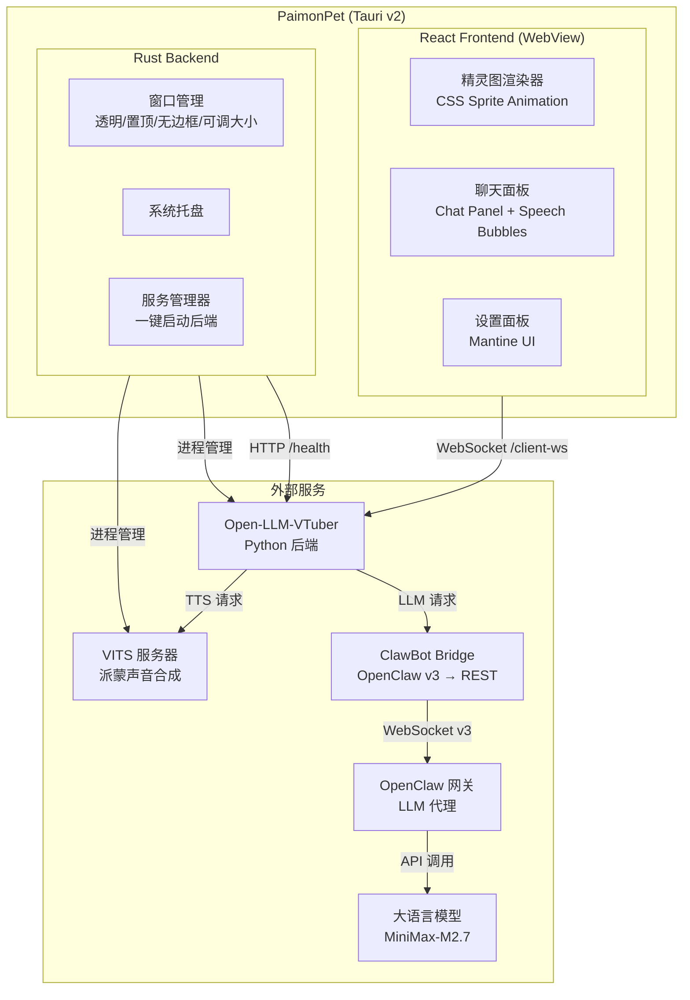

# PaimonPet

> 原神派蒙桌面宠物 — AI 语音对话 · 精灵图动画 · 桌面伴侣

PaimonPet 是一个桌面宠物应用，将原神中的派蒙带到你的桌面上。她以透明置顶窗口的形式常驻桌面，支持语音和文字对话，使用派蒙自己的声音（VITS TTS）回复。

## 功能特性

| 功能 | 说明 |
|------|------|
| 精灵图动画 | CSS 精灵图动画，多状态切换（闲置/倾听/思考/说话/拖拽） |
| 语音对话 | 按住说话 → ASR 识别 → LLM 对话 → VITS 派蒙语音合成 → 播放 |
| 文字聊天 | 点击宠物打开聊天面板，支持多轮对话 |
| 消息合并 | 同一轮对话的多个音频片段自动合并为一条消息 |
| 可调窗口 | 拖拽右下角调整窗口大小，聊天面板自适应 |
| 系统托盘 | 右键菜单：显示/隐藏/聊天/静音/点击穿透/设置/退出 |
| 设置面板 | 通用、宠物、语音、后端、高级设置 |
| 一键启动 | 应用内一键启动所有后端服务（VITS + Open-LLM-VTuber） |
| 自动路径检测 | 首次启动自动检测 ai-paimon 和 Open-LLM-VTuber 路径 |

## 系统架构



## 项目结构

```
paimon-pet/
├── src/                          # React 前端
│   ├── App.tsx                   # 主应用组件（聊天面板、状态管理）
│   ├── PhaserWrapper.tsx         # 派蒙精灵动画 + 拖拽/点击处理
│   ├── hooks/
│   │   ├── useWebSocket.ts       # WebSocket 连接 + 消息协议处理
│   │   └── useAudio.ts           # 音频播放
│   ├── services/
│   │   ├── websocketService.ts   # WebSocket 封装（重连/心跳/发送）
│   │   └── audioEncoder.ts       # WebM → PCM (Float32) 转换
│   ├── stores/
│   │   ├── chatStore.ts          # 聊天消息 + 消息合并（上限 200 条）
│   │   ├── petStore.ts           # 宠物状态
│   │   └── settingsStore.ts      # 设置（Zustand）
│   ├── settings/                 # 设置面板组件
│   └── types/                    # TypeScript 类型定义
├── src-tauri/                    # Tauri v2 Rust 后端
│   └── src/
│       ├── window/
│       │   └── tray.rs           # 系统托盘菜单
│       ├── backend/
│       │   └── process.rs        # 后端服务进程管理
│       └── commands/             # Tauri 命令（健康检查等）
├── public/sprites/paimon/        # 精灵图表 + 帧数据
└── tests/                        # 前端测试 (24 个)
```

---

## 安装指南

### 前置条件

| 依赖 | 说明 | 安装方式 |
|------|------|---------|
| [Node.js](https://nodejs.org/) 18+ | 前端构建 | 官网下载 |
| [Rust](https://rustup.rs/) | Tauri 后端 | rustup.rs |
| [Python](https://python.org/) 3.10+ | 后端服务 | 官网下载 |
| [ai-paimon](https://github.com/gaaiyun/ai-paimon) | ClawBot Bridge + VITS TTS | `git clone` |
| [Open-LLM-VTuber](https://github.com/Open-LLM-VTuber/Open-LLM-VTuber) | AI 调度引擎 | `git clone` |
| [OpenClaw](https://openclaw.com/) | LLM 网关 | 官方安装 |

> PaimonPet 是桌面端前端，需要配合 [ai-paimon](https://github.com/gaaiyun/ai-paimon) 后端服务一起使用。

### 第一步：部署后端服务

按照 [ai-paimon 部署指南](https://github.com/gaaiyun/ai-paimon#-quick-start) 完成：

1. 克隆并安装 ai-paimon：`git clone https://github.com/gaaiyun/ai-paimon.git`
2. 配置 `.env`（OpenClaw 凭证）
3. 放置 `paimon6k_390000.pth` 模型到 `models/vits/paimon/`
4. 部署并配置 Open-LLM-VTuber

> 详见 [ai-paimon 完整部署指南](https://github.com/gaaiyun/ai-paimon/blob/main/docs/setup-guide.md)

### 第二步：安装并运行 PaimonPet

```bash
# 克隆仓库
git clone https://github.com/gaaiyun/paimon-pet.git
cd paimon-pet

# 安装前端依赖
npm install

# 开发模式运行
npx tauri dev
```

首次启动后，应用会自动检测同目录下的 `ai-paimon` 和 `Open-LLM-VTuber` 路径。

### 构建发布版

```bash
npx tauri build
```

构建产物位于 `src-tauri/target/release/bundle/`，包含 MSI 安装包和 NSIS 安装程序。

---

## 使用说明

1. **启动后端** — 先启动 OpenClaw Gateway，再通过应用内的"启动"按钮一键启动 VITS 和 VTuber
2. **配置路径** — 点击派蒙 → 设置 → 后端 → 配置 ai-paimon 和 Open-LLM-VTuber 路径（通常自动检测）
3. **文字聊天** — 点击派蒙精灵打开聊天面板，输入文字按回车发送
4. **语音输入** — 按住"语音"按钮说话，松开后自动识别并发送
5. **打断** — 点击"打断"按钮中断当前回复和音频播放
6. **调整大小** — 聊天面板打开时，拖拽窗口右下角调整大小
7. **托盘菜单** — 右键系统托盘图标可快速操作（显示/隐藏/聊天/静音/点击穿透）

## 消息协议

前端通过 WebSocket (`/client-ws`) 与 Open-LLM-VTuber 后端通信：

### 客户端 → 服务器

| 类型 | 说明 |
|------|------|
| `text-input` | 文字消息 |
| `mic-audio-data` | 语音数据（Float32 PCM 16kHz） |
| `mic-audio-end` | 语音输入结束信号 |
| `interrupt-signal` | 中断当前回复 |
| `heartbeat` | 心跳保活（30 秒间隔） |
| `frontend-playback-complete` | 音频播放完成确认 |

### 服务器 → 客户端

| 类型 | 说明 |
|------|------|
| `full-text` | 完整文字回复 |
| `audio` | TTS 音频段 + `display_text` |
| `user-input-transcription` | 语音识别文本（显示用户说的话） |
| `control` | 对话链信号（`conversation-chain-start/end`） |
| `backend-synth-complete` | 所有 TTS 合成完成 |
| `state` | 宠物状态变更（thinking/speaking/idle） |

### 消息合并机制

同一轮对话中，服务器会发送多个 `audio` 消息（每句话一个音频段）。前端通过 `conversation-chain-start/end` 信号追踪对话回合，将同一轮的所有文本合并为一条聊天消息。消息存储上限 200 条，超出时自动裁剪最旧消息。

## 测试

```bash
npx vitest run              # 前端测试 (24 个)
cd src-tauri && cargo test  # Rust 测试
npx tsc --noEmit            # TypeScript 类型检查
```

## 技术栈

| 层 | 技术 | 说明 |
|----|------|------|
| 桌面框架 | Tauri v2 | Rust + WebView，透明无边框窗口 |
| 前端 | React 18 + TypeScript | SPA |
| 状态管理 | Zustand | 轻量响应式 |
| UI 组件 | Mantine 9 | 设置面板 |
| AI 后端 | Open-LLM-VTuber | Python / FastAPI / WebSocket |
| ASR | sherpa-onnx SenseVoice | 离线语音识别 |
| TTS | VITS / Edge TTS | 派蒙声音合成（48kHz） |
| LLM | MiniMax-M2.7 via OpenClaw | 大语言模型 |
| Bridge | ClawBot Bridge | OpenClaw v3 WS → OpenAI REST |

## 许可

本项目为粉丝创作，与米哈游/HoYoverse 无关。仅供个人学习使用，请勿用于商业目的。
