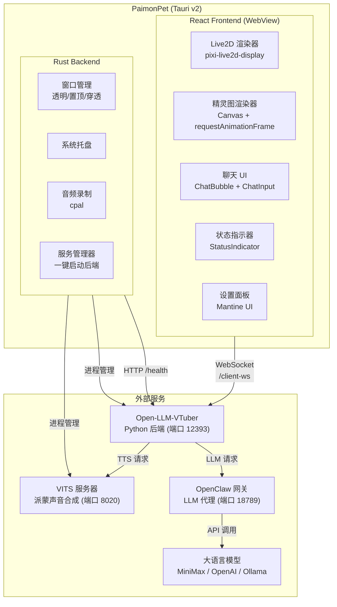
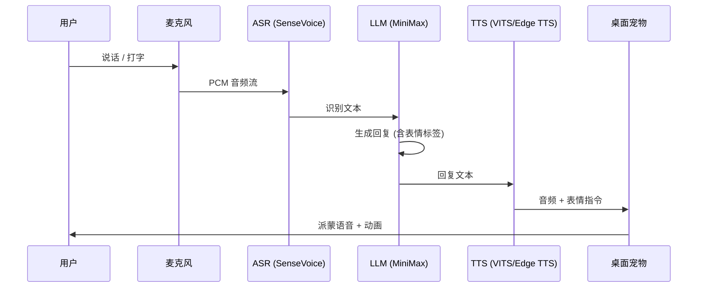

# PaimonPet 🌟

> 原神派蒙桌面宠物 — AI 语音对话 · Live2D 动画 · 桌面伴侣

PaimonPet 是一个桌面宠物应用，将原神中的派蒙带到你的桌面上。她以透明置顶窗口的形式常驻桌面，支持语音和文字对话，使用派蒙自己的声音（VITS TTS）回复，并带有 Live2D 表情动画。

## 功能特性

| 功能 | 说明 |
|------|------|
| Live2D / 精灵图双模式 | 支持完整 Live2D 模型渲染（口型同步、表情系统）和精灵图动画两种视觉模式 |
| 语音对话 | 按键说话 → 本地 ASR 识别 → LLM 对话 → VITS 派蒙语音合成 → 播放 |
| 文字聊天 | 点击宠物打开聊天输入框，打字对话 |
| 表情同步 | LLM 输出情绪标签自动映射到 Live2D 表情（开心/悲伤/愤怒/惊讶等） |
| 口型同步 | TTS 音频播放时自动同步 Live2D 嘴型参数 |
| 系统托盘 | 右键菜单：显示/隐藏/静音/设置/退出 |
| 设置面板 | 通用、宠物、语音、AI、后端、高级、关于 七大设置分类 |
| 一键启动 | 应用内一键启动所有后端服务（VITS + Open-LLM-VTuber） |

## 系统架构



## 数据流



## 项目结构

```
paimon-pet/
├── src/                          # React 前端
│   ├── components/               # PetWindow, ChatBubble, ChatInput, StatusIndicator
│   ├── renderers/                # Live2DRenderer, SpriteRenderer
│   ├── settings/                 # SettingsPanel, General/Pet/Voice/AI/Backend Settings
│   ├── stores/                   # petStore, chatStore, settingsStore (Zustand)
│   ├── hooks/                    # useWebSocket, useAudio
│   ├── services/                 # websocketService, audioService
│   └── types/                    # messages, settings, pet 类型定义
├── src-tauri/                    # Tauri v2 Rust 后端
│   └── src/
│       ├── window/tray.rs        # 系统托盘
│       ├── audio/capture.rs      # 麦克风录制
│       ├── backend/process.rs    # 后端服务管理 (一键启动)
│       ├── commands/             # Tauri 命令
│       └── config/settings.rs    # 设置类型
├── backend/                      # Open-LLM-VTuber 集成
│   ├── start.py                 # 启动脚本
│   └── conf.yaml                # 派蒙角色配置
├── scripts/
│   └── start_all.bat            # 一键启动脚本
└── tests/                        # 前端测试 (27 个测试)
```

---

## 从零开始安装指南

### 第一步：安装基础工具

#### 1.1 Node.js (v18+)

下载安装：https://nodejs.org/
```bash
node --version   # 验证：v18+ 
npm --version    # 验证：v9+
```

#### 1.2 Rust 工具链

```bash
# 安装 rustup (https://rustup.rs)
curl --proto '=https' --tlsv1.2 -sSf https://sh.rustup.rs | sh
# Windows: 下载 https://rustup.rs/x86_64-pc-windows-msvc 安装器

rustc --version  # 验证：1.80+
cargo --version  # 验证：1.80+
```

#### 1.3 Python 3.10+

下载安装：https://www.python.org/downloads/
```bash
python --version  # 验证：3.10+
```

#### 1.4 uv (Python 包管理器)

```bash
# Windows (PowerShell)
powershell -ExecutionPolicy ByPass -c "irm https://astral.sh/uv/install.ps1 | iex"

# 或使用 pip
pip install uv

uv --version  # 验证安装成功
```

### 第二步：安装 OpenClaw (LLM 网关)

OpenClaw 是连接大语言模型的网关，支持 MiniMax、OpenAI 等多种模型。

```bash
# 安装 OpenClaw CLI
npm install -g openclaw

# 登录/配置你的 AI 账号
openclaw auth login

# 启动网关（保持运行）
openclaw gateway
# 默认监听端口：18789
```

> 如果你有其他 OpenAI 兼容的 API（如 Ollama 本地模型），也可以在设置中切换。

### 第三步：安装 Open-LLM-VTuber (AI 后端)

```bash
# 克隆仓库
git clone https://github.com/Open-LLM-VTuber/Open-LLM-VTuber.git
cd Open-LLM-VTuber

# 安装依赖（自动创建虚拟环境）
uv sync
```

然后配置你的 MiniMax API Key（从 [MiniMax 开放平台](https://platform.minimax.chat/) 获取）：

```bash
# 编辑 conf.yaml，填入你的 MiniMax API Key
# llm_api_key: 'your-minimax-api-key'
# model: 'MiniMax-M2.7'
# base_url: 'https://api.minimax.chat/v1'

# 复制参考配置（从 paimon-pet 仓库）
cp ../paimon-pet/backend/conf.yaml ./

# 启动服务器
uv run run_server.py
# 默认监听端口：12393
```

### 第四步：安装 VITS 派蒙声音 (可选)

> 如果跳过此步，系统会自动使用 Edge TTS 作为备选（声音不是派蒙的）

VITS 需要派蒙的语音模型文件。模型和配置可从 HuggingFace 自动下载：

```bash
cd ai-paimon

# 安装依赖
pip install -r requirements.txt

# 下载模型（自动下载到 models/vits/paimon/）
python -c "
from huggingface_hub import hf_hub_download
hf_hub_download('hcoli/vits_models', 'vits/paimon/paimon6k_390000.pth', local_dir='./models')
hf_hub_download('hcoli/vits_models', 'vits/paimon/paimon6k.json', local_dir='./models')
print('Model downloaded!')
"

# 启动 VITS 服务器
python src/vits_server/server.py
# 默认监听端口：8020，自动检测 CUDA
```

> 如果跳过此步，系统会自动使用 Edge TTS 作为备选（声音不是派蒙的）

### 第五步：安装 PaimonPet

```bash
# 克隆仓库
git clone https://github.com/gaaiyun/paimon-pet.git
cd paimon-pet

# 安装前端依赖
npm install

# 开发模式运行
npx tauri dev
```

### 第六步：配置后端路径

应用启动后，右键系统托盘 → 设置 → **后端** 标签页：

| 配置项 | 说明 | 示例 |
|--------|------|------|
| Python 路径 | Python 可执行文件路径 | `python` 或 `C:\Python310\python.exe` |
| ai-paimon 目录 | ai-paimon 项目路径（VITS 服务器） | `C:\Users\你\paimon pet\ai-paimon` |
| VITS 模型路径 | paimon.pth 文件路径 | `./paimon.pth` |
| Open-LLM-VTuber 目录 | Open-LLM-VTuber 安装路径 | `C:\Users\你\paimon pet\Open-LLM-VTuber` |

### 第七步：一键启动

在设置面板的 **后端** 标签页中点击 **"启动所有服务"** 按钮。

或者使用脚本：
```bash
# 双击运行
scripts\start_all.bat

# 或命令行
npx tauri dev
```

应用会自动：
1. 检查 OpenClaw Gateway 是否在运行（需要你先启动 `openclaw gateway`）
2. 启动 VITS 语音合成服务器
3. 启动 Open-LLM-VTuber AI 后端
4. 等待所有服务就绪后连接

---

## 构建发布版

```bash
npx tauri build
```

生成的安装包：
- `src-tauri/target/release/bundle/nsis/PaimonPet_x64-setup.exe` (~5MB)
- `src-tauri/target/release/bundle/msi/PaimonPet_x64_en-US.msi` (~7MB)

## 测试

```bash
npx vitest run          # 前端测试 (27 个)
cd src-tauri && cargo test  # Rust 测试
npx tsc --noEmit        # TypeScript 类型检查
```

## 技术栈

| 层 | 技术 | 说明 |
|----|------|------|
| 桌面框架 | Tauri v2 | Rust + WebView，~5MB 体积 |
| 前端 | React 18 + TypeScript | SPA |
| 状态管理 | Zustand | 轻量响应式 |
| UI | Mantine 7 | 设置面板 |
| Live2D | pixi.js + pixi-live2d-display | WebGL |
| AI 后端 | Open-LLM-VTuber | Python/FastAPI |
| ASR | sherpa-onnx SenseVoice | 离线语音识别 |
| TTS | VITS / Edge TTS | 派蒙声音合成 |
| LLM | MiniMax M2.5 via OpenClaw | 大语言模型 |

## 许可

本项目为粉丝创作，与米哈游/HoYoverse 无关。仅供个人学习使用，请勿用于商业目的。
